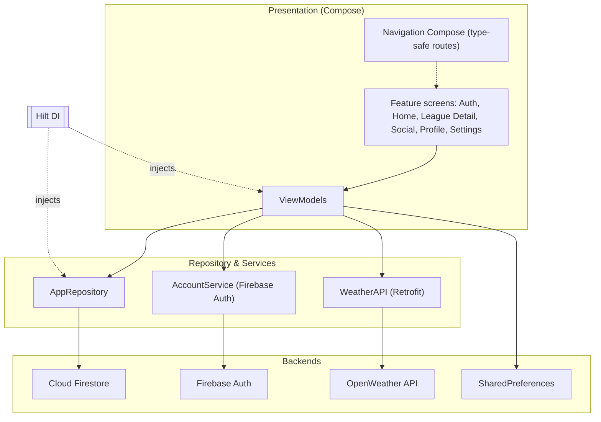

<div align="center">

# Goodminton 🏸

**Create, manage, and track your badminton leagues — leaderboards, matches, stats, and players, all in one Android app.**

[](https://www.android.com/)
[](https://kotlinlang.org/)
[](https://developer.android.com/jetpack/compose)
[](https://firebase.google.com/)
[](https://dagger.dev/hilt/)
[](./LICENSE)

</div>

Goodminton is an Android app for running **badminton leagues** end to end. Sign in,
create a league, invite participants, and let the app handle match scheduling,
scoring, standings, and player statistics in real time. Built entirely with
**Jetpack Compose** and backed by **Firebase**, it supports singles and doubles,
random or fixed pairings, friends and profiles, and a dynamic, theme-aware UI.

---

## Table of Contents

- [Overview](#overview)
- [Features](#features)
- [Tech Stack](#tech-stack)
- [Architecture](#architecture)
- [Project Structure](#project-structure)
- [Getting Started](#getting-started)
  - [Prerequisites](#prerequisites)
  - [Configuration](#configuration)
  - [Build & Run](#build--run)
- [Installation (APK)](#installation-apk)
- [How to Use](#how-to-use)
- [Contact](#contact)
- [License](#license)

---

## Overview

Goodminton turns the hassle of organizing recreational badminton into a smooth,
social experience. Every league has a creator with elevated permissions, a roster
of participants, a set of matches, and a live leaderboard. Match results flow into
per-player statistics, so you always know who's on top. Data is stored in **Cloud
Firestore** and updates in real time across devices, while authentication is
handled securely through **Firebase Auth** (Google or email/password).

## Features

| Feature | Description |
|---|---|
| **🏆 League management** | Create and manage leagues with configurable match points, public/private visibility, deuce rules, and singles/doubles modes. |
| **🤝 Random or fixed pairings** | Choose whether doubles pairs are generated randomly or kept fixed. |
| **🎓 Participants & roles** | Manage participants with roles such as **creator** and **admin** who get extra control. |
| **📅 Match scheduling & scoring** | Track matches through their lifecycle — scheduled, playing, finished — with scores. |
| **📊 Standings & statistics** | Live leaderboard plus per-player win/loss and performance stats. |
| **👥 Social** | Add friends, send/accept friend requests, and view other players' profiles. |
| **🔔 Notifications & invitations** | Receive league invitations and notifications. |
| **🌈 Dynamic & weather-aware theming** | Material 3 dynamic color and an optional weather-based theme. |
| **🌐 Localization** | Available in English and Indonesian. |
| **🔐 Secure sign-in** | Google sign-in (Credential Manager) and email/password with email verification. |

## Tech Stack

- **Kotlin** + **Jetpack Compose** (Material 3) — modern, declarative UI.
- **Hilt** — dependency injection.
- **Navigation Compose** — type-safe navigation with `kotlinx.serialization` routes.
- **Firebase Auth** — Google sign-in via **Credential Manager** + **Google Identity**, and email/password.
- **Cloud Firestore** — real-time data storage.
- **Coil** — image loading.
- **Retrofit** + **Gson** — networking for the **OpenWeather** API (weather theme).
- **Play Services Location** + **Accompanist Permissions** — location for weather theming.
- **BeeTablesCompose** — table rendering for standings.
- **Process Phoenix** — app restart (e.g. after settings changes).
- **SharedPreferences** — local settings such as dynamic color and weather theme.

## Architecture

Goodminton follows an **MVVM** architecture with a **repository** layer and
feature-based packaging. Compose screens observe ViewModels, which talk to a
repository and service layer that wrap Firebase and the weather API. Hilt wires
everything together.



## Project Structure

A high-level view of the app module:

```text
app/src/main/java/com/mightsana/goodminton/
├─ features/      # Feature modules: auth, main (home, league detail, social, profile, settings), maintenance
├─ model/         # Repository, services (Firebase, weather), DI, extensions, shared values
├─ ui/theme/      # Theming, colors, typography
├─ view/          # Reusable UI components
├─ MainActivity.kt
├─ MyNavHost.kt   # Navigation graph
└─ GoodmintonApp.kt
```

## Getting Started

### Prerequisites

- **Android Studio** (latest stable) with the Android SDK.
- **JDK 11**.
- An Android device or emulator running **Android 10 (API 29)** or higher.
- A **Firebase** project and an **OpenWeather** API key (see [Configuration](#configuration)).

### Configuration

Goodminton relies on Firebase and the OpenWeather API, so a few credentials must
be provided before building:

1. **Firebase** — create a Firebase project, add an Android app with the
   `com.mightsana.goodminton` package, enable **Authentication** (Google + Email/Password)
   and **Cloud Firestore**, then download `google-services.json` into the `app/` directory.
2. **Google sign-in** — provide your **Web client ID** as a `default_web_client_id`
   string resource (typically generated/linked via Firebase).
3. **OpenWeather** — obtain an API key from OpenWeather and supply it to the app
   for the weather-theme feature.

> ⚠️ These credentials are required to build and run the app and are intentionally
> not included in the repository.

### Build & Run

```bash
# Clone the repository
git clone https://github.com/andreasmlbngaol/goodminton.git
cd goodminton

# Build a debug APK
./gradlew assembleDebug

# Or install directly to a connected device/emulator
./gradlew installDebug
```

You can also simply open the project in **Android Studio** and run it.

## Installation (APK)

Prefer to just try the app?

1. Go to the **[Releases](https://github.com/andreasmlbngaol/goodminton/releases)** page.
2. Download the latest **`.apk`** from the release assets.
3. Install it on your Android device (you may need to allow installs from unknown sources).

## How to Use

1. **Sign in** — use Google sign-in or email/password to get started.
2. **Create a league** — set the league name, match rules (points, deuce, singles/doubles, random/fixed pairing), and visibility.
3. **Manage participants** — invite players and assign roles such as **Creator** and **Admin**.
4. **Play & track** — schedule matches, record scores, and watch the standings and stats update in real time.

## Contact

Questions or feedback? Reach out at **lgandre45@gmail.com**.

## License

This project is licensed under the **MIT License** — see the [LICENSE](./LICENSE)
file for details.

© 2024 andreasmlbngaol
